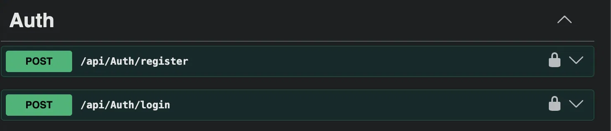
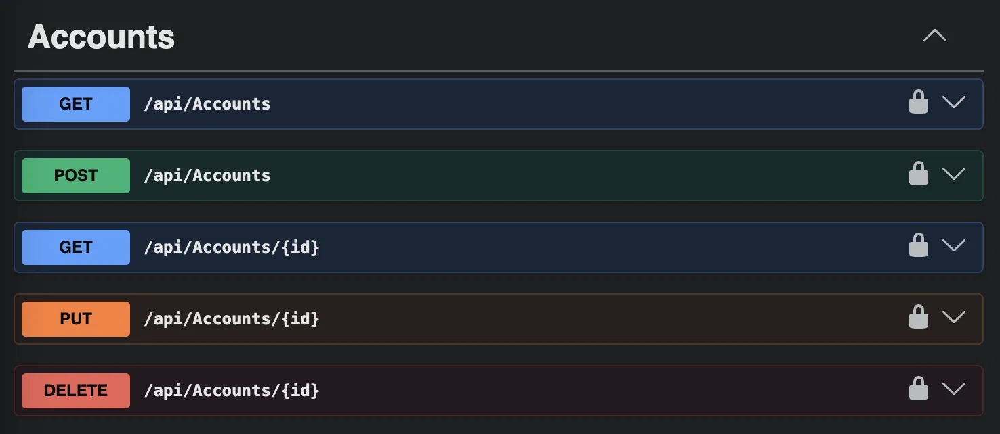
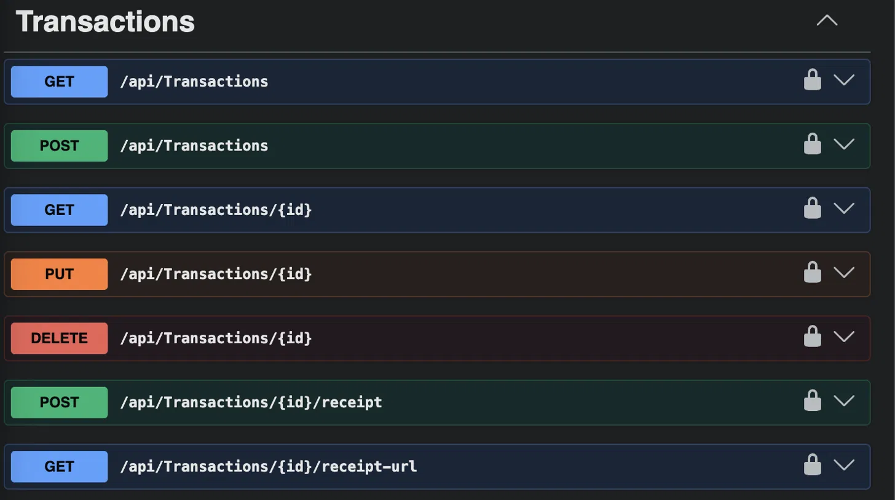
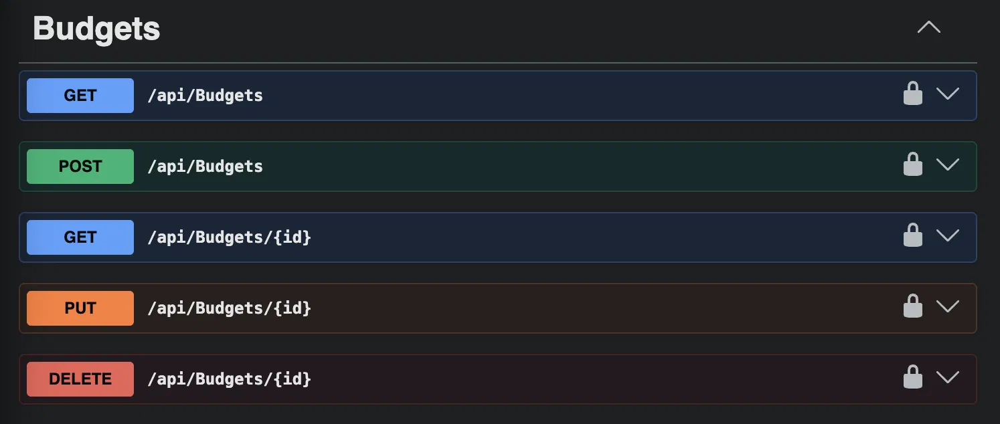
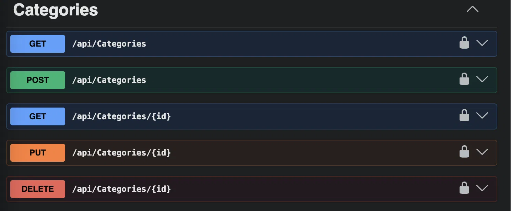
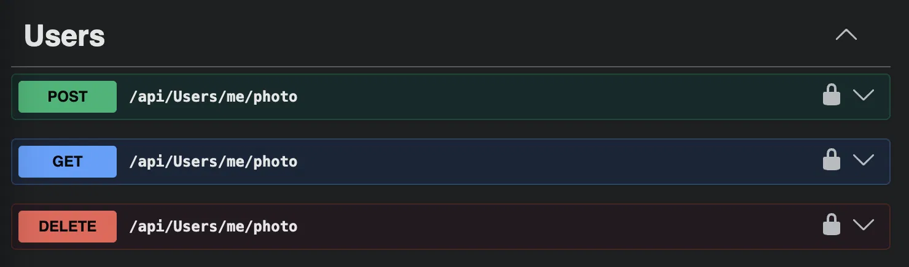

# Personal Finance Tracker — API
🔗 **Live API:** [personal-finance-tracker-api-w66o.onrender.com/swagger](https://personal-finance-tracker-api-w66o.onrender.com/swagger)

> Note: hosted on Render's free tier, which spins down after inactivity — the first request may take 30–60 seconds to wake up.
A secure, full-featured REST API for tracking personal finances — accounts, transactions, budgets, and receipts — built with ASP.NET Core, Entity Framework Core, and Azure Blob Storage.

Built as a portfolio project to demonstrate real-world backend patterns relevant to fintech/banking systems: JWT authentication, role-based authorization, ownership-scoped data access, and secure file storage.

## Features

- **Authentication** — Register/login with JWT tokens and BCrypt password hashing
- **Accounts** — Full CRUD for checking/savings-style accounts, scoped per user
- **Transactions** — Income/expense tracking with automatic account balance updates, soft-delete history, and two-layer ownership verification (transaction → account → user)
- **Budgets** — Monthly spending limits per category with live spend calculation against real transaction data
- **Receipt Upload** — Attach receipt images to transactions, stored in Azure Blob Storage with secure, time-limited SAS-token viewing (private by default — no public URLs)
- **Profile Photos** — User avatar upload, same secure storage pattern
- **Role-Based Authorization** — Admin-only category management, enforced via JWT claims
- **Swagger/OpenAPI** — Full interactive API documentation with Bearer token support

## Tech Stack

| Layer | Technology |
|---|---|
| Framework | ASP.NET Core 10 (Web API) |
| ORM | Entity Framework Core |
| Database | SQL Server (Azure SQL / local Docker) |
| Auth | JWT Bearer tokens, BCrypt.Net |
| File Storage | Azure Blob Storage (SAS tokens) |
| API Docs | Swashbuckle (Swagger UI) |
| Hosting | Azure App Service *(planned)* |

## Architecture Highlights

- **DTOs everywhere** — request/response shapes are decoupled from EF entities, preventing over-posting and accidental data leaks (e.g. password hashes never serialize)
- **Ownership-scoped queries** — every data-access query filters by the authenticated user's ID, preventing IDOR (Insecure Direct Object Reference) vulnerabilities
- **Soft deletes** — transactions are never hard-deleted, preserving financial history and audit trail, enforced globally via an EF Core query filter
- **Secure file access** — receipts and profile photos live in private Blob Storage containers; access is granted only via short-lived, cryptographically signed SAS URLs, never public links

## Getting Started

### Prerequisites
- [.NET 10 SDK](https://dotnet.microsoft.com/download)
- SQL Server (local via Docker, or Azure SQL)
- An Azure Storage Account (for receipt/photo uploads)

### Setup

1. Clone the repo:
```bash
   git clone https://github.com/JisooKang03/personal-finance-tracker-api.git
   cd personal-finance-tracker-api
```

2. Copy the example config and fill in your own values:
```bash
   cp appsettings.example.json appsettings.json
```
   Update `ConnectionStrings:DefaultConnection`, `Jwt:Key`, and `AzureBlobStorage:ConnectionString` with your own values.

3. Run database migrations:
```bash
   dotnet ef database update
```

4. Run the API:
```bash
   dotnet run
```

5. Open Swagger UI at `http://localhost:5035/swagger` to explore and test the API.

## API Overview

| Endpoint | Description |
|---|---|
| `POST /api/auth/register` | Create a new account |
| `POST /api/auth/login` | Authenticate and receive a JWT |
| `GET/POST/PUT/DELETE /api/accounts` | Manage accounts |
| `GET/POST/PUT/DELETE /api/transactions` | Manage transactions |
| `POST /api/transactions/{id}/receipt` | Upload a receipt image |
| `GET /api/transactions/{id}/receipt-url` | Get a secure, time-limited receipt URL |
| `GET/POST/PUT/DELETE /api/budgets` | Manage monthly budgets |
| `GET/POST/PUT/DELETE /api/categories` | Manage categories *(Admin only for writes)* |
| `POST/GET/DELETE /api/users/me/photo` | Manage profile photo |

## Screenshots

### Auth


### Accounts


Example response:


### Transactions
Includes receipt upload and secure receipt viewing endpoints:


### Budgets


### Categories
Admin-only write access, enforced via role-based authorization:


### Users (Profile Photo)


## Related Repo

Frontend: [personal-finance-tracker-web](https://github.com/JisooKang03/personal-finance-tracker-web)
